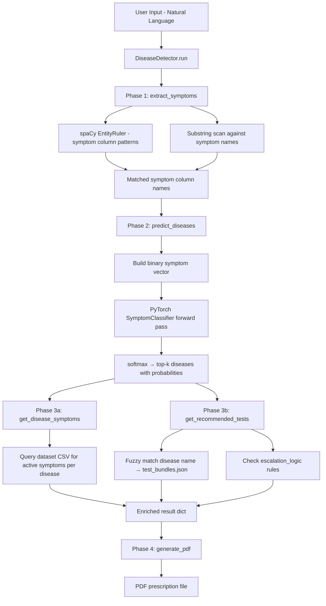
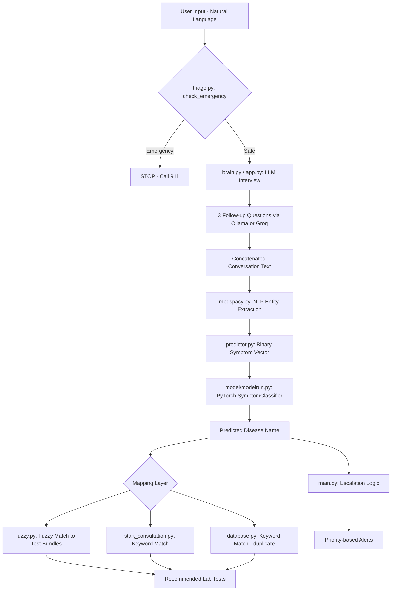

# Module Interactions — First Doctor Pipeline

## Unified Engine

### `disease_engine.py` — DiseaseDetector class
The `DiseaseDetector` class merges all three modules into a single callable pipeline:

| Phase | Method | What it does | Replaces |
|-------|--------|-------------|----------|
| 1 | `extract_symptoms(text)` | spaCy EntityRuler built from symptom column names + substring scan | `medspacy.py`, `medSpaCy.py`, `predictor.py` lines 1-4 |
| 2 | `predict_diseases(symptoms, top_k)` | Builds binary vector, runs PyTorch `SymptomClassifier`, returns top-k diseases | `model/modelrun.py`, `predictor.py` lines 6-19 |
| 3a | `get_disease_symptoms(disease)` | Looks up dataset CSV for symptom columns active for a disease | New — dataset query |
| 3b | `get_recommended_tests(disease)` | Fuzzy matches disease name against `test_bundles.json` for lab tests + escalation | `fuzzy.py`, `start_consultation.py`, `database.py`, `main.py` |
| 4 | `generate_pdf(result, patient_name)` | Generates a PDF prescription via fpdf with diagnosis, tests, and disclaimer | New |
| All | `run(text, top_k)` | Full pipeline: extract → predict → map → return enriched dict | New orchestrator |

**Dependencies at init time:**
- `model/database/dataset.csv` — must be the real CSV, not a Git LFS pointer
- `model/torch_symptom_model.pth` — PyTorch saved state dict
- `test_bundles.json` — disease/test mapping and escalation rules
- spaCy model `en_core_web_sm` — falls back to blank English if not installed

---

## Legacy Module Map

### Module 1: spaCy Keyword Extraction
| File | Role | Status |
|------|------|--------|
| `medspacy.py` | Builds medspaCy `TargetRule` list from symptom column names; adds to `medspacy_target_matcher` | **Standalone snippet** — references undefined `df` |
| `medSpaCy.py` | Minimal test: loads medspacy, runs entity extraction on hardcoded text | **Test script only** |
| `predictor.py` (lines 1-4) | Calls `nlp(text)` and reads `doc.ents` to extract detected symptoms | **Stub** — `nlp` not imported/defined |

**Key dependency:** The NLP pipeline (`nlp`) must be initialized with medspaCy and the `TargetRule` matcher loaded from symptom column names before `predictor.py` can function.

### Module 2: Pre-trained Model Prediction
| File | Role | Status |
|------|------|--------|
| `model/modelrun.py` | Loads PyTorch `SymptomClassifier`, `LabelEncoder`, exposes `predict_top_diseases()` | **Working** — primary prediction engine |
| `predictor.py` (lines 6-19) | Creates binary symptom vector, calls `model.predict()`, decodes via `encoder.classes_` | **Stub** — `model`, `encoder`, `symptom_names` undefined |
| `buildNetwork.py` | Defines a Keras/TF Sequential model (alternative architecture) | **Legacy/unused** with current PyTorch model |
| `loadData.py` | Loads CSV, fits `LabelEncoder`, splits train/test | **Training utility** — not used at inference |
| `model/torch_symptom_model.pth` | Saved PyTorch model weights | **Asset** |
| `model/database/dataset.csv` | Training dataset | **Asset** |

**Key dependency:** `model/modelrun.py` requires `dataset.csv` to reconstruct the `LabelEncoder` at load time (re-fits on every run). The model expects a fixed-length binary symptom vector matching the dataset column count.

### Module 3: Symptom Scraping / Mapping Logic
| File | Role | Status |
|------|------|--------|
| `fuzzy.py` | Fuzzy string matching via `thefuzz`: maps predicted disease → test bundles using synonyms | **Working** |
| `start_consultation.py` | Full CLI consultation flow: triage → LLM interview → keyword-based test matching | **Working** |
| `database.py` | SQLite schema + `get_tests_for_symptom()` keyword matcher | **Working** (duplicates logic from `start_consultation.py`) |
| `main.py` | Escalation logic: evaluates symptoms + lab values against trigger rules | **Working** |
| `triage.py` | Emergency keyword detection via `check_emergency()` | **Working** |
| `test_bundles.json` | JSON data: escalation rules with trigger conditions, tests, and priorities | **Data asset** |

**Key dependency:** All mapping modules read from `test_bundles.json`. The fuzzy matcher expects disease names with optional synonyms; the keyword matchers expect a `keywords` field (currently absent from `test_bundles.json` — only `escalation_logic` structure exists).

---

## Current Interaction Flow

## Known Integration Gaps

1. **`predictor.py` is disconnected** — It references `nlp`, `model`, `encoder`, and `symptom_names` but imports none of them. It serves as a design sketch for the NLP→Model bridge but is not callable.

2. **`medspacy.py` references undefined `df`** — The symptom column names must come from the dataset, but the file does not load any data. It needs to import from `loadData.py` or `model/modelrun.py`.

3. **`test_bundles.json` schema mismatch** — `start_consultation.py` and `database.py` expect `{category: {keywords: [...], tests: [...]}}` structure, but the current JSON only contains `{escalation_logic: {...}}` with trigger conditions. The keyword-based test matching in these files will return empty results.

4. **Duplicate mapping logic** — `start_consultation.py:get_tests_from_text()` and `database.py:get_tests_for_symptom()` implement identical keyword-in-text matching. Should be consolidated.

5. **Two model architectures** — `buildNetwork.py` defines a Keras/TF model while `model/modelrun.py` uses PyTorch. Only the PyTorch path is active.

6. **`model/modelrun.py` re-fits LabelEncoder on every load** — It reads the full CSV to reconstruct the encoder rather than loading a saved encoder artifact. This creates a hard dependency on the training data at inference time.

7. **Frontend (`app.py`) uses Groq API** — While `brain.py` and `start_consultation.py` use local Ollama, the Streamlit frontend uses Groq cloud. The API key is empty string.
